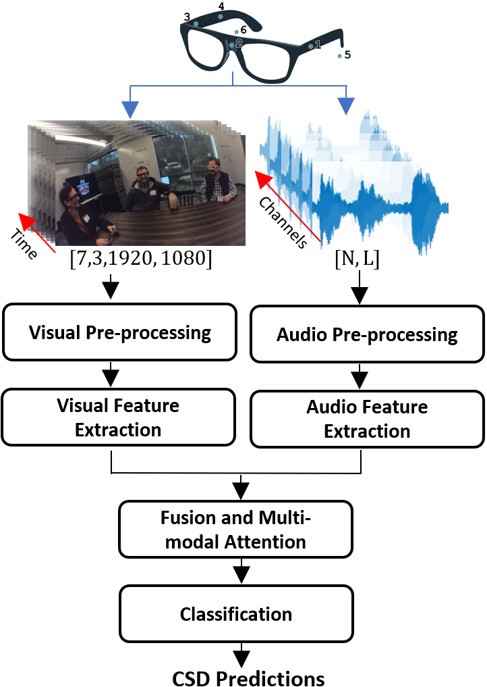

# CSD-Audio-Visual
### Audio-Visual Approach For Multimodal Concurrent Speaker Detection

This repository contains the code for the **audio-visual model** presented in the paper:  
📄 **"Audio-Visual Approach For Multimodal Concurrent Speaker Detection"**  
🔗 [Link to Paper](https://arxiv.org/abs/2407.01774)  

## 📂 Repository Structure
```bash
CSD-Audio-Visual/
├── doc/
│   └── Figures/
├── src/
│   ├── XXX.py
│   └── Inference.py
├── README.md
└── ...
```
* **`doc/Figures/`**: Contains the figures used in this repository
* **`CSD_model.py`**: PyTorch implementation of our proposed CSD model.<br/>
* **`Inference.py`**: This file provides a demonstration of how to use the CSD model for inference. <br/>
It includes code for generating a random input of the same shape as the model's expected input and then using the model to generate predictions.
Additionally, it prints the model's summary.


## 📌 Overview
This model classifies audio-visaul segments into three categories:

1️⃣ **Noise only**  
2️⃣ **Single-speaker activity**  
3️⃣ **Concurrent-speaker activity**  

The method was evaluated on **AMI, and EasyCom** datasets.

Our primary focus is on Concurrent Speaker Detection (CSD), which classifies audio segments into the three classes above.
For comparison with existing methods, we also evaluate our model on the related binary classification tasks:<br/>
1️⃣ **Voice Activity Detection (VAD)**: Distinguishes between speech (single/multiple speakers) and non-speech.  
2️⃣ **Overlapped Speech Detection (OSD)** : Identifies segments with overlapped versus non-overlapped speech.  


## Model Architecture - High Level
The high-level architecture of our proposed model is presented in the following figure.<br/>
....
<p align="center">
  
</p>


## 📄 Citation  
If you use this work, please cite:

  ```bibtex
@article{eliav2024audio,
  title={Audio-Visual Approach For Multimodal Concurrent Speaker Detection},
  author={Eliav, Amit and Gannot, Sharon},
  journal={arXiv preprint arXiv:2407.01774},
  year={2024}
}
```
